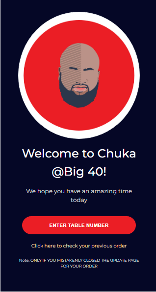
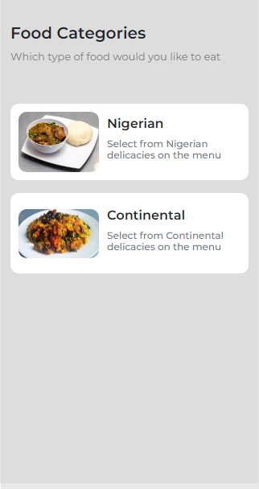
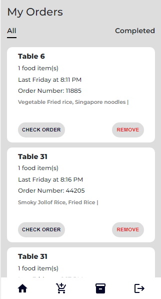
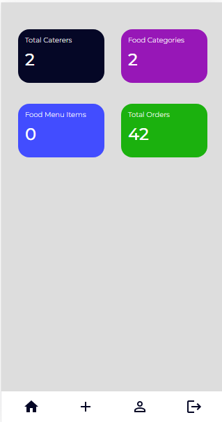

# Chuka@40

### A web-app for ordering meals in a party
[click here to check out live link here](http://chuka40.vercel.app)

## Tools used

### React
### Redux
### Bootstrap
### Firebase

## What is this app all about?

#### Chuka@40 is a web-app built with react and powered by firebase for the backend. The app has three sides. Guest, Admin and Caterer Side.

## Guest Side Homepage

  
#### Guest would be able to pick any food they want to eat in the food menu

## Caterer Side Homepage

  
#### Caterers should see the food items that has been ordered by the guest with the guest identification details and information. Caterers are also able to delete food items that are out of stock and many other features.

[https://chuka@40.vercel.app/caterers](https://chuka@40.vercel.app/caterers)

## Admin Side Homepage

#### The Admin is able to add food items to the food menu, create and assign meals to caterers and many other features

[https://chuka@40.vercel.app/admin](https://chuka@40.vercel.app/admin)

## Chuka@40 web-app has many other features. 
[https://chuka@40.vercel.app](https://chuka@40.vercel.app)
[https://chuka@40.vercel.app/admin](https://chuka@40.vercel.app/admin)
[https://chuka@40.vercel.app/caterers](https://chuka@40.vercel.app/caterers)

